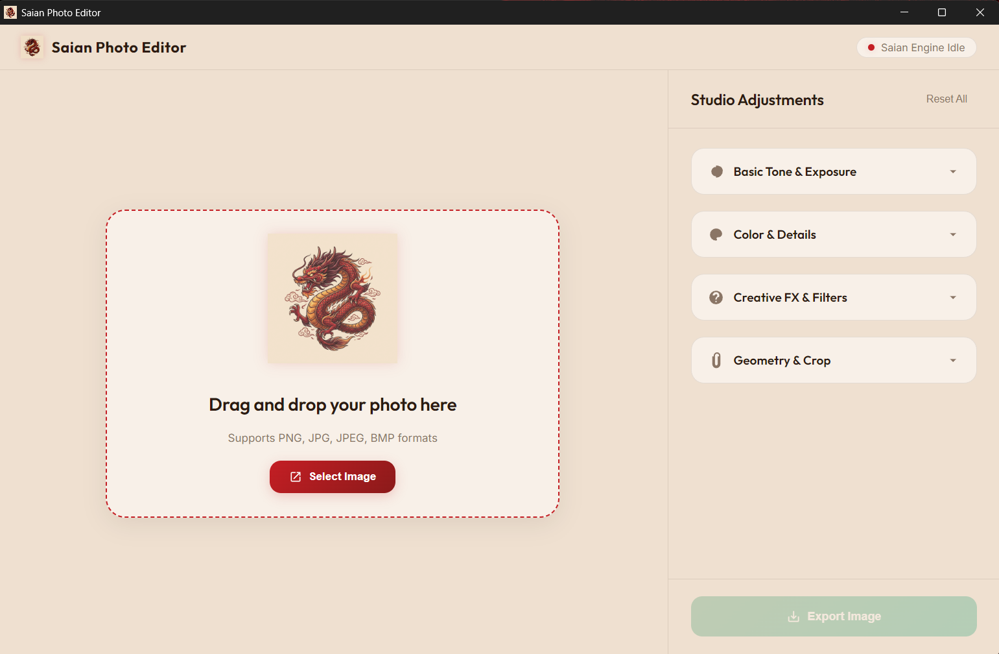
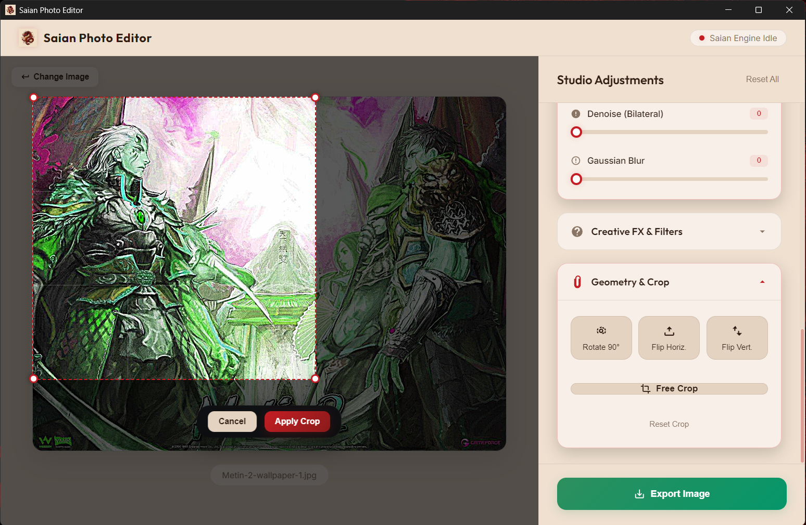

<p align="center">
  
</p>

<h1 align="center">🐉 Saian Photo Editor</h1>

<p align="center">
  <b>A high-performance, real-time image editor powered by C++ OpenCV engine with an Electron desktop interface.</b>
</p>

<p align="center">
  
  
  
  
</p>

---

## ✨ Features

- 🎨 **Real-time Preview** — All adjustments update live as you move sliders, powered by a native C++ backend
- ☀️ **Basic Tone & Exposure** — Brightness, Contrast, Exposure, Gamma Correction, Highlights, Shadows
- 🌈 **Color & Details** — Saturation, Hue Shift, Color Temperature (Warm/Cool), Sharpness, Denoise (Non-Local Means), Blur
- 🎭 **Creative FX** — Sepia, Grayscale, Invert, Pencil Sketch, Vignette (Black & White)
- 📐 **Geometry & Crop** — Rotate 90°, Flip Horizontal/Vertical, Free Crop with Rule-of-Thirds grid
- 🖼️ **Drag & Drop** — Simply drag any image onto the window or click to browse
- 🔄 **Change Image** — Switch to a different image anytime without restarting
- 💾 **Export** — Save your edited image with a system save dialog
- 🐉 **Chinese Dragon Theme** — Warm parchment cream & crimson red aesthetic

## 📸 Screenshots

<p align="center">
  
</p>

<p align="center">
  
</p>

> 💡 *Add your own screenshots to the `screenshots/` folder*

## 🚀 Quick Start (Pre-built)

1. Download the latest release from the [Releases](../../releases) page
2. Run **`Saian Photo Editor_Setup_1.0.0.exe`** to install
3. Or use the portable version from `win-unpacked/` folder

## 🛠️ Build from Source

### Prerequisites

- **Node.js** 18+ — [Download](https://nodejs.org/)
- **Visual Studio 2022/2026** with C++ Desktop Development workload
- **OpenCV 4.9** — Pre-built Windows binaries ([Download](https://opencv.org/releases/))

### Steps

```bash
# 1. Clone the repository
git clone https://github.com/YOUR_USERNAME/saian-photo-editor.git
cd saian-photo-editor

# 2. Install dependencies
npm install

# 3. Build the C++ engine
cd backend
python build.py
cd ..

# 4. Run in development mode
npm start

# 5. Build installer (.exe setup)
npm run dist
```

## 🏗️ Architecture

```
Saian Photo Editor
├── main.js              # Electron main process
├── index.html           # UI layout
├── style.css            # Warm cream + dragon red theme
├── renderer.js          # Frontend logic & IPC communication
├── dragon.png           # Dragon logo
├── package.json         # App config & build settings
│
├── backend/
│   ├── main.cpp         # C++ OpenCV image processing engine
│   ├── CMakeLists.txt   # CMake build config
│   ├── build.py         # Automated build script
│   └── bin/
│       ├── engine.exe   # Compiled C++ engine
│       └── opencv_world490.dll
│
└── screenshots/         # App screenshots for README
```

### How It Works

1. **Electron** handles the desktop window and UI rendering
2. **renderer.js** captures slider/button changes and sends them via IPC
3. **main.js** spawns the C++ engine as a child process and communicates via stdin/stdout
4. **engine.exe** (C++ with OpenCV) processes the image with all parameters and saves the result
5. The preview image is reloaded in the UI — all in real-time!

## 🎛️ Adjustment Parameters

| Category | Parameter | Range | Default |
|----------|-----------|-------|---------|
| **Tone** | Brightness | -100 to 100 | 0 |
| **Tone** | Contrast | 0.0 to 3.0 | 1.0 |
| **Tone** | Exposure | 0.0 to 3.0 | 1.0 |
| **Tone** | Gamma | 0.1 to 3.0 | 1.0 |
| **Tone** | Highlights | -1.0 to 1.0 | 0.0 |
| **Tone** | Shadows | -1.0 to 1.0 | 0.0 |
| **Color** | Saturation | 0.0 to 3.0 | 1.0 |
| **Color** | Hue Shift | -90 to 90 | 0 |
| **Color** | Temperature | -50 to 50 | 0 |
| **Detail** | Sharpness | 0.0 to 5.0 | 0.0 |
| **Detail** | Denoise | 0 to 15 | 0 |
| **Detail** | Blur | 0 to 25 | 0 |
| **FX** | Vignette | -1.0 to 1.0 | 0.0 |
| **FX** | Sepia | Toggle | Off |
| **FX** | Grayscale | Toggle | Off |
| **FX** | Invert | Toggle | Off |
| **FX** | Sketch | Toggle | Off |
| **Geometry** | Rotate | 0° / 90° / 180° / 270° | 0° |
| **Geometry** | Flip H/V | Toggle | Off |
| **Geometry** | Free Crop | Interactive | - |

## 📄 License

This project is open source and available under the [MIT License](LICENSE).

## 🙏 Credits

- **OpenCV 4.9** — Computer vision library
- **Electron** — Desktop app framework
- **Inter & Outfit** — Google Fonts typography

---

<p align="center">
  Made with ❤️ and 🐉
</p>
